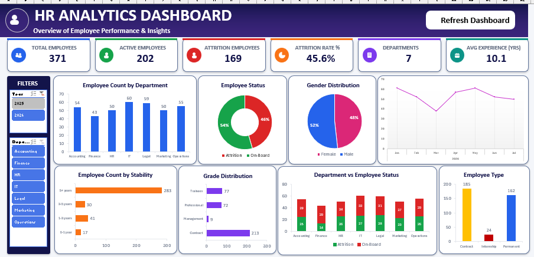

# HR Analytics Portfolio

An HR Analytics project combining **Microsoft Excel Dashboarding** and **PostgreSQL SQL Analysis** to analyze employee data, workforce distribution, hiring trends, employee stability, experience, and attrition.

---

## 📊 Project Overview

This project analyzes HR employee data using two different analytical approaches:

- **Microsoft Excel** — Interactive HR dashboard, PivotTables, and visual analysis
- **PostgreSQL SQL** — Structured HR data analysis using SQL queries

The project demonstrates practical skills in **Data Analysis, Excel, SQL, PostgreSQL, PivotTables, Dashboarding, Aggregation, and Business Reporting**.

---

## 🛠️ Tools & Technologies

| Tool | Purpose |
|---|---|
| Microsoft Excel | HR Dashboard & Data Analysis |
| PivotTables | Data Summarization |
| Excel Charts | Data Visualization |
| PostgreSQL | Database Analysis |
| SQL | HR Data Analysis |
| GitHub | Project Documentation |

---


---

# 📊 Excel HR Analytics Dashboard

The Excel project contains three main components:

### Dashboard

The Dashboard provides a visual overview of the HR dataset using charts and summary analysis.

### Pivot

The Pivot sheet contains supporting analysis including:

* Employee count by department
* Employee count by gender
* Employee status
* Employee type
* Marital status
* Year-wise employee analysis
* Stability analysis
* Grade analysis
* Department vs Employee Status
* Average experience analysis

### Data

The Data sheet contains the employee-level dataset used for the dashboard and PivotTable analysis.

Key fields include:

* Employee Status
* Employee ID
* Name
* Date of Joining
* Date of Relieving
* Employee Type
* Category
* Date of Birth
* Marital Status
* Grade
* Department
* Total Experience
* Year
* Month
* Stability

---

# 🗄️ SQL HR Analysis

The SQL project is developed using **PostgreSQL** and contains multiple HR analysis queries.

## SQL Analysis Included

### 01. Data Preview

Quickly previews employee records before detailed analysis.

### 02. Total Employees

Calculates the total number of employee records.

### 03. Employee Status

Analyzes employees based on employment status.

### 04. Department Distribution

Analyzes employee distribution across departments.

### 05. Gender Distribution

Analyzes employee distribution by gender.

### 06. Hiring Trend by Year

Analyzes employee joining trends across different years.

### 07. Department-wise Attrition

Calculates:

* Total Employees
* Attrition Count
* Attrition Rate

for each department.

### 08. Gender-wise Attrition

Compares employee count and attrition across gender groups.

### 09. Grade-wise Attrition

Analyzes attrition across different employee grades.

### 10. Marital Status Analysis

Compares employee count and attrition across marital status groups.

### 11. Employee Status by Joining Year

Analyzes employee status across different joining years.

### 12. Average Experience by Department

Calculates average total experience for each department.

### 13. Stability Analysis

Groups employees by stability level and compares:

* Total Employees
* Active Employees
* Attrition Employees
* Attrition Rate

### 14. Department Ranking

Ranks departments based on employee count using the SQL `RANK()` window function.

### 15. Attrition Contribution by Department

Calculates each department's contribution to total attrition.

### 16. Quarter-wise Joining Trend

Analyzes employee joining patterns by year and quarter.

### 17. Final HR Analytics Summary

Creates a department-level summary containing:

* Total Employees
* Active Employees
* Attrition Employees
* Attrition Rate
* Average Experience
* Employee Count Rank

---

# 🧠 SQL Concepts Demonstrated

This project demonstrates practical use of:

```text
SELECT
WHERE
GROUP BY
ORDER BY
COUNT()
AVG()
ROUND()
FILTER
CASE
CTE (WITH)
RANK()
Window Functions
SUM() OVER()
EXTRACT()
NULLIF()
```

---

# 📈 Key Analysis Areas

```text
Employee Workforce
│
├── Department
├── Gender
├── Employee Type
├── Grade
└── Marital Status

Employee Lifecycle
│
├── Joining Year
├── Joining Quarter
├── Stability
└── Attrition

Employee Experience
│
└── Average Total Experience
```

---

# 📂 Dataset

The Excel workbook contains **988 employee records**.

The dataset includes employee-level information related to:

* Employment status
* Employee type
* Demographic information
* Joining date
* Relieving date
* Department
* Grade
* Total experience
* Stability

---

# 🎯 Project Objectives

The main objectives of this project are to:

* Analyze the overall employee workforce
* Understand department-wise employee distribution
* Analyze employee attrition
* Explore demographic distributions
* Analyze employee joining trends
* Study employee stability
* Compare average experience across departments
* Perform HR analysis using PostgreSQL
* Build an interactive HR dashboard using Excel

---

# 💡 Skills Demonstrated

## Excel

* PivotTables
* Dashboard Creation
* Data Visualization
* Data Summarization
* HR Reporting

## SQL

* PostgreSQL
* Data Aggregation
* Conditional Aggregation
* Common Table Expressions
* Window Functions
* Ranking
* Date Analysis
* Grouping & Filtering

## Data Analytics

* Workforce Analysis
* Attrition Analysis
* Trend Analysis
* Department Analysis
* Employee Experience Analysis
* Comparative Analysis

---

# 📸 Project Preview

## Excel Dashboard



## SQL Analysis


---

# 🚀 How to Use

## Excel

1. Download the Excel workbook from the `HR_Analysis` folder.
2. Open `HR-Analytics-Dashboard.xlsm` using Microsoft Excel.
3. Open the **Dashboard** sheet.
4. Explore the supporting **Pivot** and **Data** sheets.

## SQL

1. Open PostgreSQL or a compatible SQL environment.
2. Create/load the `employees` table.
3. Open `SQL-HR-Analytics/HR-Analytics.sql`.
4. Execute the queries section by section.
5. Review the generated HR analysis results.

---

# 📌 Project Focus

This project demonstrates how the same HR dataset can be analyzed using both:

### Excel

**Dashboard → PivotTables → Visualization**

### SQ

**Database → Queries → Aggregation → Analysis**

Together, these provide a practical example of an end-to-end HR Analytics workflow.

---

## 👤 Author

**Shamim**

Data Analytics Portfolio Project

---

⭐ Thanks for visiting this project!


